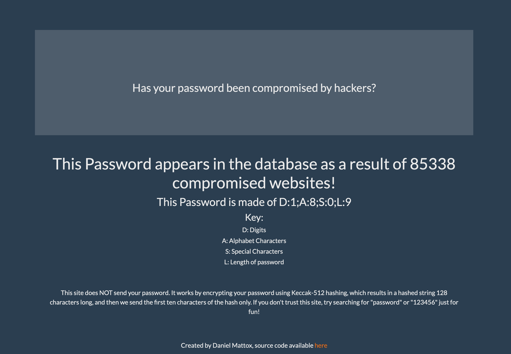

## Has my password been leaked?

This is a complete rewrite using all that I've learned since finishing training.

- This project is front-end only. 
- Added docker. 
- Finally responsive.

### About:
Tasked with finding and communicating with any free (open) API, I found one for checking passwords.
How it, and my works is by hashing the password into an unrecognizable string of characters 512 bytes long! Then out of all of that mess, we only send the first 10 characters to the API!!! With the data they send a reply whether or not the password has been leaked online.

### Tech Stack:
- React for components
- ~~Redux~~ Context for state
- Keccak Hashing Algorithm
- Axios for calls
- Bootstrap through ~~Reactstrap~~ React-Bootstrap with Bootswatch theming for style

This code is deployed [HERE](https://pw.danielmattox.com)

