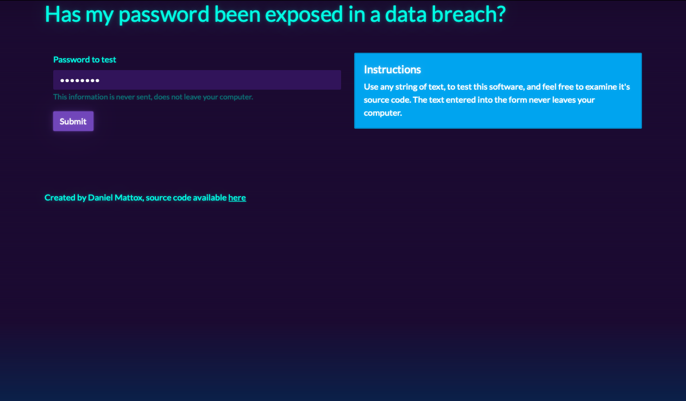
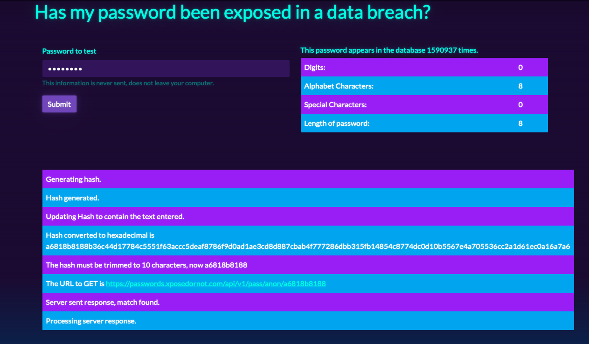
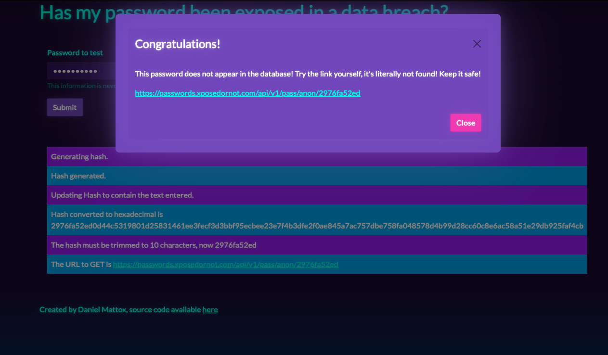
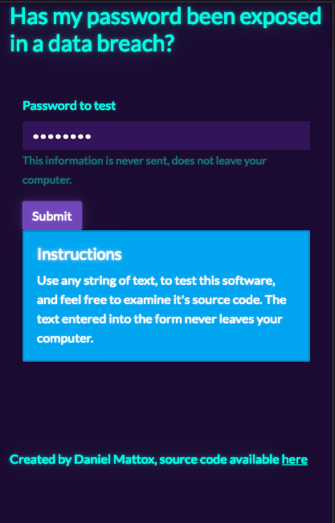
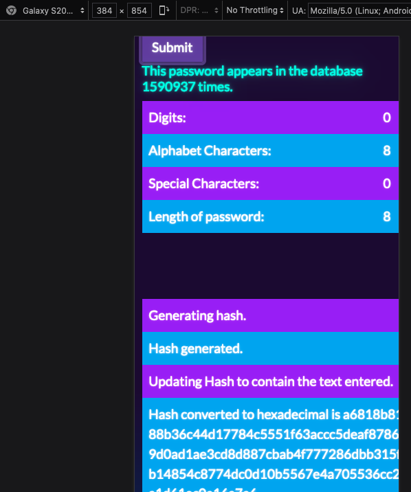

## Has my password been leaked?

This code is deployed [HERE](https://pw.danielmattox.com) via docker on my own server.

This is a complete rewrite using all that I've learned since finishing training.

- This project is front-end only.
- Added docker. 
- Finally responsive.
- Uses conditional rendering via both inline and HOC methods.
- Passes props around through both prop-drilling and Context Provider
- No clever one-liners.
- Seriously that useApi hook is the most terse code I've written to date.
- Consistent use of named exports.
- Hire me.

### About:
Tasked with finding and communicating with any free (open) API, I found one for checking passwords.
How it, and my front-end works is by hashing the password into an unrecognizable string of characters 512 bytes long! Then out of all of that mess, we only send the first 10 characters to the API!!! With the data they send a reply whether or not the password has been leaked online.

### Tech Stack:
- React for components
- ~~Redux~~ Context for state
- Keccak Hashing Algorithm
- Axios for calls
- Bootstrap through ~~Reactstrap~~ React-Bootstrap with Bootswatch theming for style

